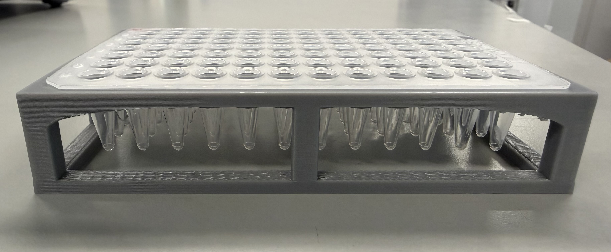

# 96-well non-skirted plate (AB0600) adapter
  

## Description

Adapter for securing standard SBS-format 96-well non-skirted PCR plates onto the liquid handlers deck.  

## Origin

Designed and developed by **ExFAB Biofoundry**.  

## Compatible Platforms

- Opentrons  
- Tecan  

Labware definition files are provided in this directory for direct use with the adapter:

- **Opentrons:** `thermoscientificnonskirted_96_wellplate_300ul.json`  
- **Tecan:** `96 Well nonskirt adapter LnZ 3.2.zeia`

These files allow the adapter to be used directly on the respective platforms without additional labware configuration.  

## Compatible Labware

- Standard SBS 96-well non-skirted plate (Thermo Scientific, cat no. [AB0600](https://www.thermofisher.com/order/catalog/product/AB0600?utm_source=labspend.com))

## Revision

v3.2

## Print Settings

- Material: PLA (recommended)
- Layer height: 0.2 mm
- Infill: 30%
- Supports: Everywhere
- Orientation: Upside down

## Tested On

- Printer: Prusa CORE One
- Slicer: PrusaSlicer 2.9
- Date Tested: 2026-02-01
- Used Filament: 53.41 g
- Estimated printing time: 2.5 hrs

## Notes

Verify deck calibration before use.
Not manufacturer certified.
