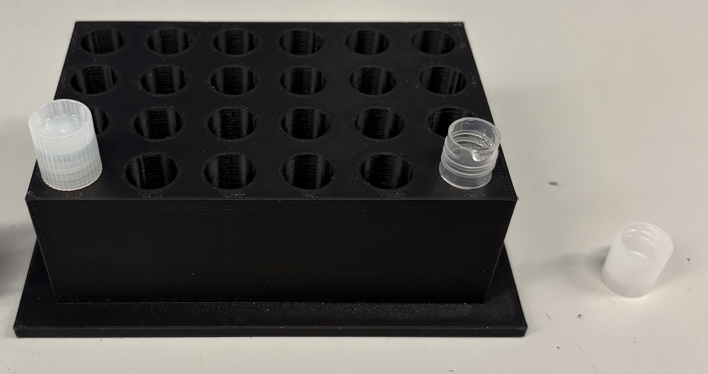

# 24-well tube block (SBS)

## Description

SBS-format 24-well block able to hold 1.5 mL and 2 mL screw cap tubes on the liquid handlers.

## Compatible Platforms

- Opentrons
- Tecan

## Compatible Labware

- Nalgene™ General Long-Term Storage Cryogenic Tubes 1.5 mL (cat no.5000-1020)
- Nalgene™ General Long-Term Storage Cryogenic Tubes 2.0 mL (cat no.5000-0020)
    - Also works for any similarly sized tubes
  
## Version

v5.0

## Print Settings

- Material: PLA
- Layer height: 0.2 mm
- Infill: 20 %
- Supports: None
- Orientation: Right side up

## Tested On

- Printer: Prusa CORE One
- Slicer: PrusaSlicer 2.9
- Date Tested: 2/20/26
- Used Filament: 127.17 g
- Estimated printing time: 4 h 26 m

## Notes

Verify deck calibration before use.
Not manufacturer certified.
This block can also hold 1.5 and 2 mL snaptubes but there is no place to support the caps, therefore a seperate version is necessary for said tubes.
