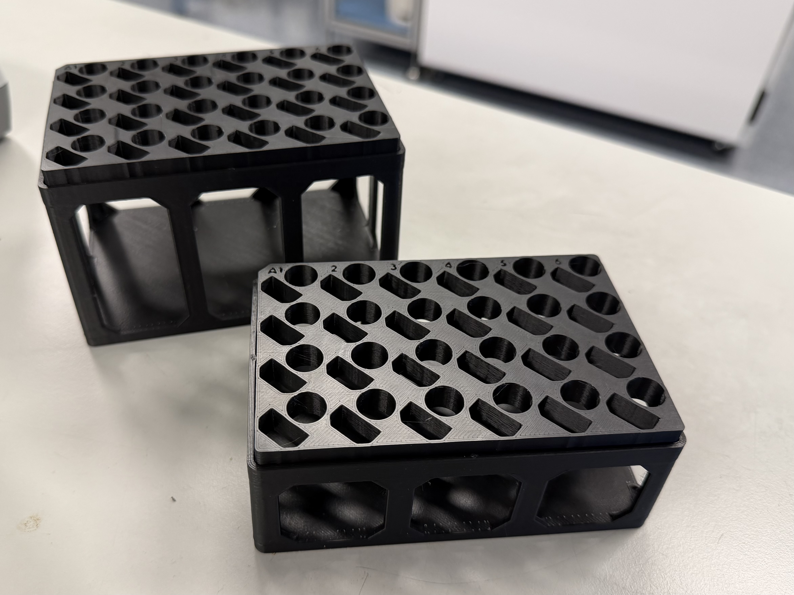

# 24-Well Tube Rack (with cap holes, Third-Party Design)

## Description

A 24-well tube rack to hold **1.5 mL and 2 mL microcentrifuge tubes** on a liquid handler deck.  

The design includes **cap holes that help stabilize tube caps**, making the rack compatible with both **screw-cap and snap-cap tubes** during automated workflows.

## Origin

Original design by **thehair**.  
Source: https://www.thingiverse.com/thing:3405002  
License: Creative Commons Attribution-ShareAlike (CC BY-SA)

This design originates from Thingiverse and is not maintained by ExFAB.  
Please refer to the original source for downloads, updates, and licensing details.

## ExFAB Notes

Tested for compatibility with:

- Tecan  
- Opentrons  

Labware definition files are provided in this directory for direct use with the rack:

- **Opentrons:** `xxxx.json`  
- **Tecan:** `xxxx.zeia`

These files allow the rack to be used directly on the respective platforms without additional labware configuration.  

No modifications have been made to the original design.
